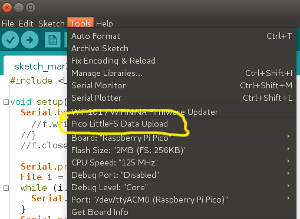

# Arduino Pico LittleFS Filesystem Uploader for IDE 1.x

Arduino plugin which packs sketch data folder into LittleFS filesystem image,
and uploads the image to Raspberry Pi Pico RP2040 flash memory.
 

## Arduino IDE 2.x users
Please see the [arduino-littlefs-plugin](https://github.com/earlephilhower/arduino-littlefs-upload) for use under IDE 2.2.1 or later

## Installation
- Make sure you use one of the supported versions of Arduino IDE and have the Arduino-Pico core (https://github.com/earlephilhower/arduino-pico) installed.
- Download the tool archive from (https://github.com/earlephilhower/arduino-pico-littlefs-plugin/releases).
- In your Arduino sketchbook directory, create tools directory if it doesn't exist yet.
- Unpack the tool into tools directory (the path will look like `<home_dir>/Arduino/tools/PicoLittleFS/tool/picolittlefs.jar)`.
- Restart Arduino IDE.

On the OS X create the tools directory in `~/Documents/Arduino/` and unpack the files there.

## Usage
- Open a sketch (or create a new one and save it).
- Go to sketch directory (choose Sketch > Show Sketch Folder).
- Create a directory named `data` and any files you want in the file system there.
- Make sure you have selected a board and port.
- Close the Serial Monitor, or else the tool will not be able to upload the filesystem.
- Select `Tools > Pico LittleFS Data Upload` menu item. This should start uploading the files into flash file system.
  When done, IDE status bar will display LittleFS Image Uploaded message. Might take a few minutes for large file system sizes.

## Screenshot

## Credits and license

- Copyright (c) 2015 Hristo Gochkov (ficeto at ficeto dot com)
- Licensed under GPL v2 ([text](LICENSE))
- Modified by Earle F. Philhower, III for LittleFS use
